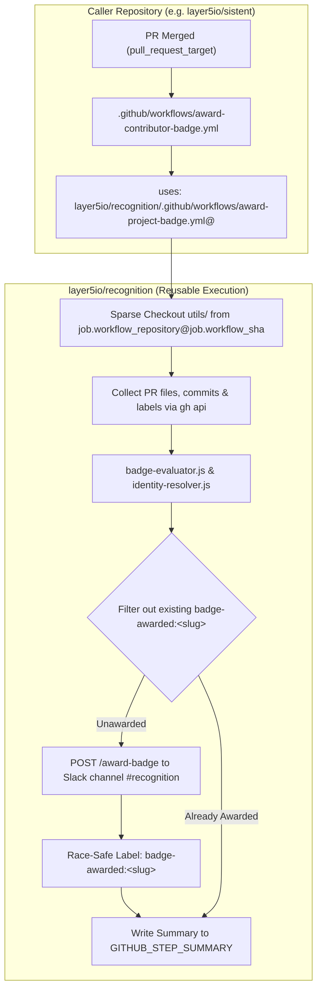

# Track 2: Project Contribution PR Merges Badge Automation

Automated contributor badge assignments upon Pull Request merges across Layer5 and Meshery repositories, hardened with award-level duplicate mitigation, race-safe label creation, PR-level concurrency guards, and executed via GitHub's native reusable workflow job context.

Part of the **Layer5 Recognition System** ([Issue #116](https://github.com/layer5io/recognition/issues/116)).

---

## 1. Overview & Scope

Track 2 automates immediate contributor recognition for merged Pull Requests across participating ecosystem repositories. It evaluates PRs against declarative rules for the **8 authoritative project-specific badges**, verifies contributor attribution and DCO compliance, dispatches award commands, and records tracking labels on the merged PR for idempotency.

### The 8 Authoritative Badges

| Badge Slug | Official Title | Scope & Target Repositories | Heuristic & Qualifying Files | False-Positive Exclusion Guards |
| :--- | :--- | :--- | :--- | :--- |
| `sistent-contributor` | **Sistent Contributor** | `layer5io/sistent` | Modifies `src/**`, `packages/**`, `system/**` | Excludes root non-code metadata (`.github/**`, `.gitignore`, `LICENSE`, `CODE_OF_CONDUCT.md`). |
| `meshery` | **Meshery** | `meshery/meshery` | Modifies core functional codebase (`server/**`, `mesheryctl/**`, `models/**`, `install/**`, `main.go`) | Excludes PRs modifying only `docs/**` (earns `meshery-docs`), root markdown (`README.md`, `ROADMAP.md`), or `.github/**`. |
| `meshery-operator` | **Meshery Operator** | `meshery/meshery-operator` | Modifies operator controllers/APIs (`controllers/**`, `api/**`, `pkg/**`, `main.go`) | Excludes root non-code metadata (`.github/**`, `LICENSE`, `README.md`). |
| `meshsync` | **MeshSync** | `meshery/meshsync` | Modifies MeshSync daemon logic (`internal/**`, `pkg/**`, `main.go`) | Excludes root non-code metadata (`.github/**`, `LICENSE`, `README.md`). |
| `meshery-docs` | **Meshery Docs** | `meshery/meshery`, `layer5io/docs` | Modifies documentation paths (`docs/**` in Meshery, `content/**`, `pages/**` in Layer5 Docs) | Generic `**/*.md` is forbidden; strictly scoped to verified documentation trees. |
| `meshery-catalog` | **Meshery Catalog** | `meshery/meshery.io`, `meshery/meshery` | Modifies catalog items (`catalog/**`, `collections/catalog/**` in Meshery.io, `models/**` in Meshery) | Excludes non-catalog site assets and generic docs. |
| `landscape` | **Landscape** | `layer5io/layer5` | Modifies landscape data (`src/collections/landscape/**`) | Strictly scoped to landscape collection. Excludes blog, news, and member collections. |
| `ui-ux` | **UI/UX** | `meshery/meshery`, `layer5io/sistent`, `layer5io/layer5` | Requires label `area/ui` or `area/ux` AND modifications in frontend components (`ui/**`, `src/**`, `src/components/**`, `src/sections/**`) | Excludes unit tests (`**/*.test.*`, `**/__tests__/**`), lockfiles, and non-frontend packages. |

---

## 2. Architecture & Security Model



### Zero Untrusted Code Execution

1. **Privileged Base Context**: The caller workflow triggers on `pull_request_target: types: [closed]` with `github.event.pull_request.merged == true`. It runs strictly within the base repository's context.
2. **Zero Fork Checkout**: Pull request fork code is **never** checked out on the runner.
3. **Immutable Trusted Engine Checkout**: The runner checks out only the trusted evaluation engine from `layer5io/recognition` at the exact immutable commit SHA of the workflow using GitHub's native job context:
   ```yaml
   - name: Checkout trusted recognition engine
     uses: actions/checkout@11bd71901bbe5b1630ceea73d27597364c9af683 # v4.2.2
     with:
       repository: ${{ job.workflow_repository }}
       ref: ${{ job.workflow_sha }}
       path: .recognition-engine
       sparse-checkout: |
         utils
   ```
4. **Explicit Caller Targeting**: All GitHub API and CLI operations explicitly target `TARGET_REPO="${{ github.repository }}"` and `PR_NUMBER="${{ inputs.pr_number }}"`.

---

## 3. Concurrency, Idempotency & Error Handling

### 3.1 Per-PR Concurrency Lock
To prevent duplicate awards or overlapping dispatches from rapid events or manual workflow reruns:
```yaml
concurrency:
  group: badge-award-${{ github.repository }}-${{ inputs.pr_number }}
  cancel-in-progress: false
```
`cancel-in-progress: false` ensures that any in-flight award dispatch completes its sequential award-and-label cycle cleanly before another run begins.

### 3.2 Race-Safe Label Creation
Before applying a tracking label (`badge-awarded:<slug>`), the engine verifies if it exists on the caller repository. If missing, it calls `POST /repos/${TARGET_REPO}/labels` and handles the response:
- **`201 Created`**: Success; proceeds to apply.
- **`422 Validation Failed`**: Inspects response body. If and only if the error payload contains `code: "already_exists"` (e.g. created concurrently by a parallel run), it treats it as success.
- **All Other HTTP Codes (`401/403/404/5xx`)**: Fails immediately as a fatal error.

### 3.3 Two-Step Sequential Award
For each pending unawarded badge, the workflow executes sequentially:
$$\text{1. Slack Dispatch } (/award-badge) \longrightarrow \text{2. GitHub Tracking Label Write } (badge-awarded:<slug>)$$

- **Pre-Dispatch Filter**: Badges already possessing `badge-awarded:<slug>` on the PR are filtered out before dispatch.
- **Partial Failure Recovery**: If badge 1 dispatches and is labeled, but badge 2 fails, a rerun safely skips badge 1 (its label exists) and dispatches only badge 2.

---

## 4. Contributor Attribution & DCO Verification

`utils/identity-resolver.js` verifies:
1. **GitHub Author Verification**: Commit `author.login` matches the PR author login.
2. **DCO Compliance**: All author commits must contain a valid `Signed-off-by: Name <email>` trailer.
3. **Safe Obfuscation**: Contributor emails are masked (`u***r@domain.com`) in all logs and `$GITHUB_STEP_SUMMARY` to protect contributor privacy.

---

## 5. Local Development & Testing

### Running Unit Tests
All core modules have zero external dependencies and use Node.js's native test runner:

```bash
# Run all engine unit tests
npm run test:badge-engine

# Or run individual test suites
node --test utils/badge-evaluator.test.js
node --test utils/identity-resolver.test.js
node --test utils/award-orchestrator.test.js
```

### Dry-Run Testing of Historical PRs
Maintainers can test any historical PR across any ecosystem repository using `.github/workflows/test-badge-evaluator.yml`:
1. Navigate to **Actions** $\rightarrow$ **Test Badge Evaluator (Dry-Run)** in `layer5io/recognition`.
2. Click **Run workflow**.
3. Enter the `repository` (e.g., `layer5io/sistent` or `meshery/meshery`) and `pr_number`.
4. Inspect the generated Step Summary and evaluation report. No live Slack commands or GitHub labels will be issued.

---

## 6. Onboarding Caller Repositories (Phases 2 & 3)

To onboard a repository (e.g. `layer5io/sistent`), add `.github/workflows/award-contributor-badge.yml`:

```yaml
name: Award Contributor Badges

on:
  pull_request_target:
    types: [closed]

permissions:
  contents: read
  issues: write
  pull-requests: write

jobs:
  award:
    name: Process Merged PR Badges
    if: github.event.pull_request.merged == true
    uses: layer5io/recognition/.github/workflows/award-project-badge.yml@<PINNED_SHA>
    with:
      pr_number: ${{ github.event.pull_request.number }}
    secrets:
      SLACK_BOT_TOKEN: ${{ secrets.SLACK_BOT_TOKEN }}
```
